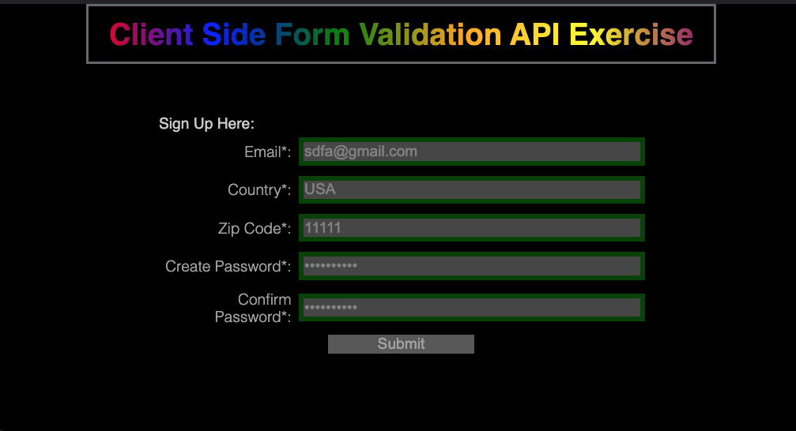

# Client Side Form Validation API Exercise

Not a 'project' per se, but it's it's own contained thing so why not?  I made it with Webpack and ES6 modules, feature/bug branches, and I  **tried** to make it look a little more modern and then abandoned that hope and left it in it's current state. Design is a skill to learn I suppose.

## Takeaways

Took me longer than expected on the actual exercise part.   Code could benefit from a refactor, but it works. There is for sure some duplication, but for 5 elements, I wasn't going to go whole hog.

Things I couldn't figure out but weren't core functionality but would improve UX:

1 - I wanted the custom validity message that would populate with reportValidity(), but I wasn't able to figure out how to let the user tab out of the field with reportValidity() involved in any way shape or form.. I did a decent scour and wasn't able to figure that out. Super annoying as a user who filled the form out too many times before adding in values to the form to populate valid/invalid data.  I know I could have added a error span and show hid that based on conditional logic, I just liked the look of the tooltips.

2 - The submit button was an input element and if you were keyboard tabbing through the form, it would skip over that element since it was disabled until after you left focus on the last form input.

Open to any feedback, Not looking to add any features or functionality not required by the exercise,  For example Country doesn't validate against actual countries, nor is zip code appropriate (I believe) for anywhere but the US, but any low-hanging fruit on my code or design advice **Would be Appreciated**

Thank you!!!!
